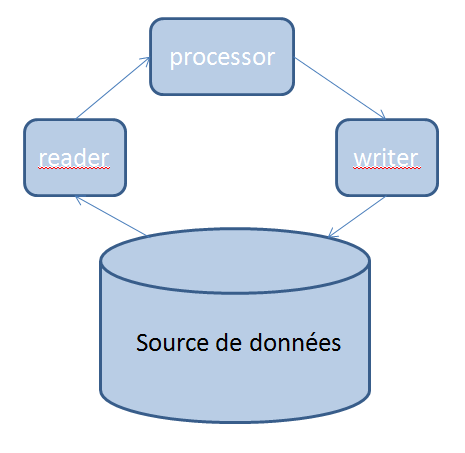

# Bienvenue sur Thoddlang.org

Ceci est mon premier article de blog.

## Thoddlang c'est avant tout

Thoddlang (Thodd de son petit nom) est avant tout un langage de programmation par flux et fonctionnel qui vise à la simplicité et l'élégance du développement favorisant ainsi la maintenabilité et réutilisabilité du code.

Thodd permet de modéliser les traitements des flux de données de manière aussi pure fonctionnellement que possible. Les interactions avec les IO (socket, fichier, ...) sont cloisonnées dans certains types de fonctions (***reader, writer, listener*** et ***processor***).

Quant à la modélisation des données, Thodd met à disposition la classique structure (*struct*) présent dans bon nombre de langage (c, c++, java, ...). Un ensemble de type dit natif est a disposition pour permettre la composition de ceux-ci dans des structures plus complexe. On parlera de type axiomatique.

De même qu'il existe des types axiomatiques, Thodd possède un ensemble de fonctions de base (les fonctions axiomatiques) qui permettent les opérations de base nécessaires au développement des programmes modernes (fonctions arithmétiques, booléennes, les *reader* natifs (socket, file), les *writer* natifs, ...).

Enfin, contrairement à de nombreux langages fonctionnels pures, Thodd permet la construction des données en plusieurs étapes, ne respectant ainsi pas entièrement le principe d'*immutabilité* cher aux autres langages fonctionnel. Cette constructions multiphase se fait au travers de fonctions dite ***builder***.

Enfin (encore ? :D), Thodd innove en permettant plusieurs *"main"* (plusieurs points d'entrée) au sein du même programme. Le mot ***main*** n'est donc pas un nom de fonction comme en C, mais un mot clé qui peut être apposé sur toute fonction dite ***listener*** ou bien ***reader***.

Voilà, ce qu'est Thodd.

## Thoddlang et les fonctions : une grande histoire d'amour

Nous l'évoquions dans la présentation de Thodd, il possède plusieurs types de fonctions :

* ***reader*** : lit une donnée dans le flux.
* ***listener*** : écoute **indéfiniment** les données dans le flux.
* ***processor*** : transforme / calcule des résultat à partir des données lues / écoutées depuis le flux.
* ***builder*** : construit les structures de données pour les ***processor***.
* ***writer*** : écrit le résultat d'un ***processor*** ou d'un ***reader***/***listener*** dans le flux.

### ***Reader***

Un ***reader*** est une fonction permettant d'extraire une donnée depuis un flux (socket, fichier, entrée standard, ...) :

    reader read_socket(string ip, int flags): bytes ;

Il existe un ensemble de fonctions axiomatiques ***reader*** permettant d'intéragir avec les flux classiques.

    reader read_socket (string ip, int flags) : bytes | string | int | ... ;
    reader read_file (string name, int flags) : bytes | string | int | ... ;
    reader read_stdin (int flags)             : bytes | string | int | ... ;
    ...

A partir de ces fonctions axiomatiques on peut définir des fonctions plus pratiques pour un développeur moderne (qui aura la volonté d'intéragir avec une socket réseau ? :p ). La création de ces nouveaux ***reader*** sera vu en détail dans un autre article. A titre d'exemple :

    reader read_mysql_table (mysql_schema schema, string tablename) : table {
      ... // Définition du reader
    }

### ***Listener***

Les fonctions ***listener*** sont semblables aux ***reader***, mais à la différence de ces dernières, elles lisent en permanence le flux de données. Et quand il n'y a plus de donnée à lire, elles attendent qu'une nouvelle donnée soit écrite sur le flux par un ***writer*** pour aller la lire.

Il existe une fonction ***listener*** axiomatique equivalente pour chacun des ***reader*** axiomatique fourni par Thodd.

    listener listen_socket (string ip, int flags) : bytes | string | int | ... ;
    listener listen_file (string name, int flags) : bytes | string | int | ... ;
    listener listen_stdin (int flags)             : bytes | string | int | ... ;
    ...

### ***Processor***

Les fonctions ***processor*** réprésentent le scope fonctionnelle pure de Thodd. Quand on est dans le contexte de ces fonctions, on ne peut faire appel qu'à d'autres fonctions ***processor*** ou bien ***builder***. Il s'agit d'une erreur de compilation que de faire appel à tout autre type de fonction. Les effets de bords sont ainsi évités au sein des ***processor*** et éliminant ainsi un ensemble de bugs classiques de la programmation.

OK, mais c'est quoi un ***processor*** ?

Un ***processor*** est une fonction **pure** au sens mathématique du terme **n entrées, UNE sortie, pas d'effet de bord**.

    processor increment (int nb, int pas) {
      return __add (nb, pas) ;
    }

### ***Builder***

Les fonctions ***builder***, probablement la famille de fonctions qui risque de faire grincer des dents les puristes des langages fonctionnels

### ***Writer***

### Définition d'un flux

